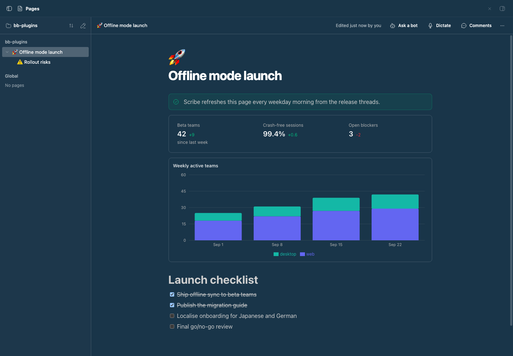

# bb-plugin-pages

Collaborative documents for BB that you write together with your agents.
Pages gives you a Notion-style block editor with live multiplayer editing,
comments, charts, and embeds. It also connects to
[Bot Teams](../bb-plugin-bot-teams): @mention a bot in a page to hand it
work, or give a page an owner bot that keeps it up to date on a schedule.

## Staged preview



This is the real BB **Pages** panel, opened from the nav panel. The capture
script seeds a project page called "Offline mode launch" with a nested
"Rollout risks" sub-page, using the plugin's own `create` RPC. The page holds:
- a tip callout
- a stats block with three key numbers and their deltas
- a stacked bar chart of weekly active teams
- a launch checklist with two items done

The sidebar shows the project's page tree, expanded to the sub-page, and an
empty Global section. The header shows the breadcrumb, the last edit, and the
**Ask a bot**, **Dictate**, and **Comments** buttons. **Dictate** appears
because Talk is installed in the staged app. The script deletes both pages
afterwards.

## What you get

- **A block editor.** Built on [BlockNote](https://www.blocknotejs.org): type
  `/` for headings, lists, checklists, toggles, quotes, code, tables, images,
  video, audio, files, and the custom blocks below. Blocks can be dragged,
  nested, and turned into other types. Markdown shortcuts work as you type.
- **Live collaboration.** Every page is a Yjs document synced over a
  WebSocket. Agents and bots edit the same document from the server, so their
  changes stream into your editor, with cursors, while you keep typing.
- **Custom blocks.** Callouts, charts (bar, line, area, pie), stat rows, and
  embed cards for links, BB threads, and other pages.
  Charts and stats are edited as JSON, which makes them easy for agents to
  write.
- **Mentions.** Type `@` to mention a bot, another page, a BB thread, or a
  date. Page and thread mentions open where they point.
- **Comments.** Select text to comment on it. Threads show in a sidebar where
  you can reply, react, edit, and resolve. Agents can read, start, reply to,
  and resolve threads.
- **A page tree.** Pages belong to a project or are global, and nest to any
  depth. Rename, give pages an emoji icon, move them, archive them, or
  delete them from the sidebar.
- **Version history.** Pages saves a version before an agent's or bot's first
  edit in a while. You can save one yourself and restore any version, and the
  current page is saved before a restore.

## Dictation with Talk

With the [Talk](../bb-plugin-talk) plugin installed, you can dictate into a
page:

- **Dictate** in the header, or **Dictate** in the `/` menu, starts Talk. Press
  **Stop dictation** or ✓ in Talk's pill to finish, and the transcript goes in
  at your cursor. Blank lines in the transcript start new paragraphs. If you
  haven't clicked into the page yet, the text goes at the end.
- *Talk: Start or finish dictation* from the command palette works while the
  cursor is in a page.
- If you finish while you're somewhere else, Talk keeps the text. Its **Go
  back** button reopens the page, and the text is added when the page loads.

Talk does the recording, transcription, and durability. Pages only marks the
editor as a Talk dictation field and inserts the text Talk hands it. Without
Talk, the dictation controls are hidden.

## Bot Teams integration

Needs the Bot Teams plugin. Requests run in each bot's DM thread with the
bot's configured model and reasoning level.

- **@mention a bot in the page.** Write what you need and mention the bot in
  the same block, for example *"@Scribe fill this table in from the pricing
  thread"*. The bot reads the page, makes the edit, and leaves a comment on
  that block saying what it did.
- **@mention a bot in a comment.** The bot answers in the thread and makes
  any change you asked for. Once a bot has replied in a thread, your later
  replies there go to it too.
- **Ask a bot.** The header button sends a request about the whole page.
- **Keep updated.** Pick an owner bot, a schedule (hourly, every morning,
  weekday mornings, Monday mornings, or a custom cron), and what to keep
  current. The bot revisits the page on that schedule. **Refresh now** runs it
  immediately.

The strip under the title shows each request as queued, working, done, or
failed, with the bot's reply. Pages remembers which mentions and comments it
has already sent, so bots are never asked twice.

## For agents

Agents get eight tools: `pages_list`, `pages_read`, `pages_create`,
`pages_edit`, `pages_comments`, `pages_comment`, `pages_comment_reply`, and
`pages_comment_resolve`. `pages_read` returns Markdown with a block id after
each block, and `pages_edit` applies small operations against those ids. An
agent can then change one checklist item or paragraph without overwriting
what you are typing.

The same actions are available from the CLI:

```sh
bb pages list [--all]
bb pages show <page-id|title> [--ids]
bb pages create <title> [--global] [--markdown <text>]
bb pages append <page-id|title> <markdown…>
```

[skills/pages/SKILL.md](skills/pages/SKILL.md) documents the tools, the
Markdown extensions (charts, stats, embeds, callouts, mentions), and the bot
workflows.

## Storage

Pages, versions, uploads, and bot requests live in the plugin's SQLite
database in the BB data directory. Uploads are limited to 15 MB each and are
served back through the plugin's HTTP route.

## Development

```sh
pnpm install
pnpm typecheck
pnpm test
bb plugin build .
bb plugin install . --yes
```
