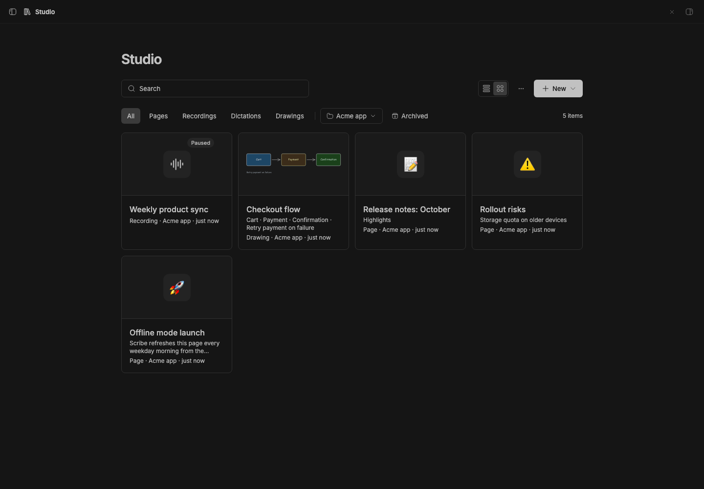

# Studio

> **Studio** is the core of **BB Studio**, a suite of plugins for writing, talking, drawing, tracking tasks, and keeping what your agents make: Studio, [Studio Pages](../bb-plugin-pages), [Studio Talk](../bb-plugin-talk), [Studio Draw](../bb-plugin-excalidraw), [Studio Artifacts](../bb-plugin-artifacts), and [Studio Tasks](../bb-plugin-studio-tasks).

One collection for everything the Studio add-ons make: pages, Talk
recordings and dictations, drawings, and saved artifacts. Search across all of them, filter by
kind and project, and hand any of them to an agent.

## Staged preview



Captured from the running BB application: the Studio collection in a staged
project, listing a page, a Talk recording and a drawing side by side, with
the kind filters and New menu in the header.

## What you get

- **One collection** (sidebar → Studio): every add-on's items in one list or
  grid, with search over titles and content, kind pills, a project filter,
  and an Archived view. Drawings show thumbnails; recordings show their
  length and word count.
- **Shared actions**: select items (shift-click for a range) to start a
  **New thread** that mentions them, move them to a project, archive, or
  delete. Actions an add-on defines, like Talk's "Copy transcripts" or Draw's
  "Copy text", appear when the selection is all that kind.
- **New ▾** creates any kind an installed add-on offers, in the current
  project.
- **Takes over from the add-ons.** With Studio installed, each add-on's own
  collection hands over to Studio filtered to its kind, and item pages lead
  back to Studio. Studio's ⋯ menu can hide the add-ons' sidebar rows, so
  Studio is the only entry. Without Studio, each add-on works on its own.
- **For agents**: the `studio_list_items` tool, the `bb studio` CLI, and a
  `studio` skill.

```sh
bb studio list [--all] [--kind <kind>] [--query <text>] [--json]
bb studio providers
```

## How it works

- Add-ons implement the Studio provider contract (`studio_describe`,
  `studio_list`, `studio_search`, `studio_create`, `studio_move`,
  `studio_archive`, `studio_delete`, `studio_action`) from
  [`@bb-studio/kit`](../studio-kit), and publish them for RPC discovery.
  Studio finds them with `bb.sdk.plugins.experimental_discoverRpc` and calls
  them with `callRpc`. Any plugin can join the suite this way.
- An add-on tells Studio when its items change (`studio_changed`); Studio
  relays that over realtime and the open collection refetches.
- A stopped or failing add-on shows up as unavailable instead of breaking the
  collection.
- Studio stores nothing. Each add-on owns its data, editors, tools, CLI and
  mentions.

See [`docs/studio.md`](../../docs/studio.md) for the design.

## Development

```sh
pnpm typecheck
pnpm test
bb plugin build .
```

`@bb-studio/kit` is a `file:../studio-kit` dependency. Keep
`package-lock.json` current (regenerate it in a clean clone, not the pnpm
workspace), because BB's Git install runs `npm install` from it.
