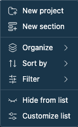
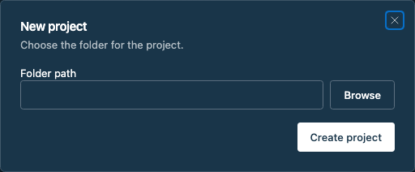

# Thread List Plus

Thread List Plus replaces BB's Thread List sidebar provider. It keeps the
thread list and its organization controls, and adds **New project** to the
**Threads ⋯** menu. The action opens a folder picker or accepts a folder path,
creates the project through BB's Plugin SDK, and opens it.

It works alongside Bot Teams: Bot Teams provides the sidebar navigation and
Thread List Plus provides the thread list below it. The bundled Thread List
plugin remains installed; selecting Thread List Plus as the thread list
provider switches the visible list.

Install this package in BB, then choose **Thread List Plus** in
**Settings → Appearance → Sidebar → Thread list provider**. The package requires
BB 0.44 or newer and Plugin SDK 0.5.29 or newer.

The `source/` directory is a fork of BB's MIT-licensed Thread List plugin at
commit `4354b88ce`, with project creation added. The `dist/` directory contains
the compiled plugin loaded by BB. See [LICENSE](LICENSE) for the upstream
license.

## Staged preview

The screenshot is captured from the running BB sidebar, with the replacement
provider selected. The capture asserts that the live menu contains **New
project**.

The dialog capture opens the live menu action and checks for the folder path,
Browse, and Create project controls. No project is created during capture.
